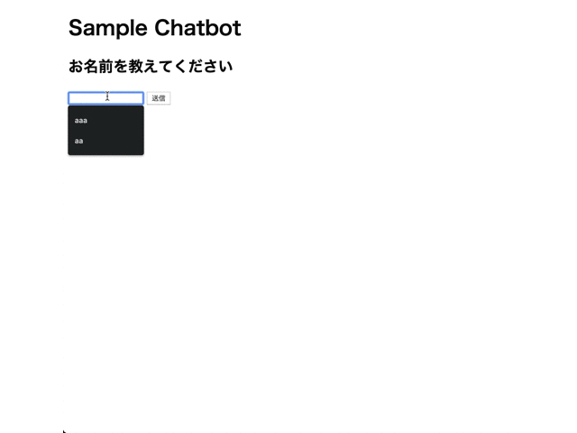

# JavaScript 演習問題　解答

# 1. 以下のGIF画像のような画面を作成せよ。


- HTMLファイル(color.html)

```html :color.html
<!DOCTYPE html>
<html lang="en">

<head>
    <meta charset="UTF-8">
    <meta name="viewport" content="width=device-width, initial-scale=1.0">
    <meta http-equiv="X-UA-Compatible" content="ie=edge">
    <title>Color</title>
    <script type="text/javascript" src="color.js"></script>
</head>

<body>
    <h1>Color Change</h1>

    <form>
        <input type="text" name="color" id="color" value="">
        <input type="button" name="send" id="send" value="送信" onclick="send_color()">
    </form>

    <div id="change">
        色を変更します。
    </div>

</body>

</html>
```

- JavaScriptファイル(color.js)

```javascript :color.js
function send_color() {
    var color = document.getElementById('color').value;
    document.getElementById('change').style.backgroundColor = color;
}
```

## 2. 以下のGIF画像のような画面を作成せよ。


- HTMLファイル(pyramid.html)

```html :pyramid.html
<!DOCTYPE html>
<html lang="en">

<head>
    <meta charset="UTF-8">
    <meta name="viewport" content="width=device-width, initial-scale=1.0">
    <meta http-equiv="X-UA-Compatible" content="ie=edge">
    <title>Pyramid</title>
    <script type="text/javascript" src="pyramid.js"></script>
</head>

<body>
    <h1>Pyramid</h1>

    <form>
        <h2>ピラミットの段数を指定してください</h2>
        <input type="text" name="stage" id="stage">
        <input type="button" name="send" id="send" value="送信" onclick="send_stage()">
    </form>

    <div id="pyramid"></div>

</body>

</html>
```

- JavaScriptファイル(pyramid.js)

```javascript :pyramid.js
// 空白スペース
var space = '\u00a0';
// アスタリスク
var asterisk = '*';

function send_stage() {
    var pyramid = document.getElementById('pyramid');
    // すでにピラミッドが描写されている場合は削除
    while (pyramid.firstChild) {
        pyramid.removeChild(pyramid.firstChild);
    }
    var stage = document.getElementById('stage').value;
    var paragraph = document.createElement('p');
    // ピラミッドを描写する
    for (var i = 1; i <= stage; i++) {
        var text = document.createTextNode(space.repeat(stage - i) + asterisk.repeat(2 * i - 1));
        paragraph.appendChild(text);
        var br = document.createElement('br');
        paragraph.appendChild(br);
    }
    pyramid.appendChild(paragraph);
}
```

## 3. 以下のGIF画像のような画面を作成せよ。



- HTMLファイル(chatbot.html)

```html :chatbot.html
<!DOCTYPE html>
<html lang="en">

<head>
    <meta charset="UTF-8">
    <meta name="viewport" content="width=device-width, initial-scale=1.0">
    <meta http-equiv="X-UA-Compatible" content="ie=edge">
    <title>Chatbot</title>
    <script type="text/javascript" src="chatbot.js"></script>
</head>

<body>
    <h1>Sample Chatbot</h1>

    <div id="question"></div>

    <div>
        <input type="text" name="message" id="message" value="" />
        <input type="button" name="send" id="send" value="送信" onclick="send_message()">
    </div>

    <div id="answer"></div>
</body>

</html>
```

- JavaScriptファイル(chatbot.js)

```javascript :chatbot.js
// 画面ロード時に初回の質問を表示する
window.onload = function () {
    var first_question = '<h2>お名前を教えてください<h2>';
    var first_output = document.getElementById('question');
    first_output.innerHTML = first_question;
}

// 質問管理番号
var sequence = 0;

function send_message() {
    question = document.getElementById('question').innerHTML;
    message = document.getElementById('message').value;
    document.getElementById('answer').innerHTML += question + '<br>' + message;

    if (sequence == 0) {
        set_next_question('出身地を教えてください');
    }
    if (sequence == 1) {
        set_next_question('趣味を教えてください')
    }
    if (sequence == 2) {
        set_next_question('好きな食べ物を教えてください')
    }
    if (sequence == 3) {
        set_next_question('ご回答ありがとうございました');
        document.getElementById('message').setAttribute('disabled', 'disabled');
        document.getElementById('send').setAttribute('disabled', 'disabled');
    }
    sequence++;
}

function set_next_question(next_question) {
    var add_question = '<h2>' + next_question + '<h2>';
    var add_output = document.getElementById('question');
    add_output.innerHTML = add_question;
    document.getElementById('message').value = '';
}
```