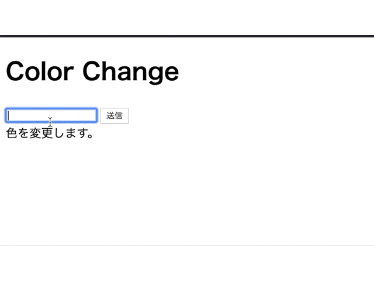
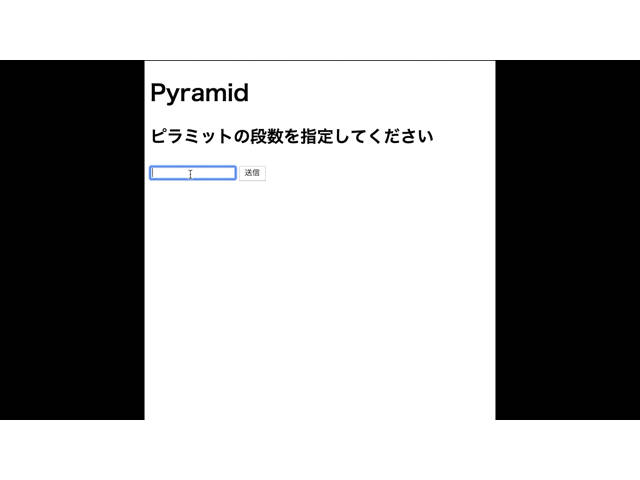
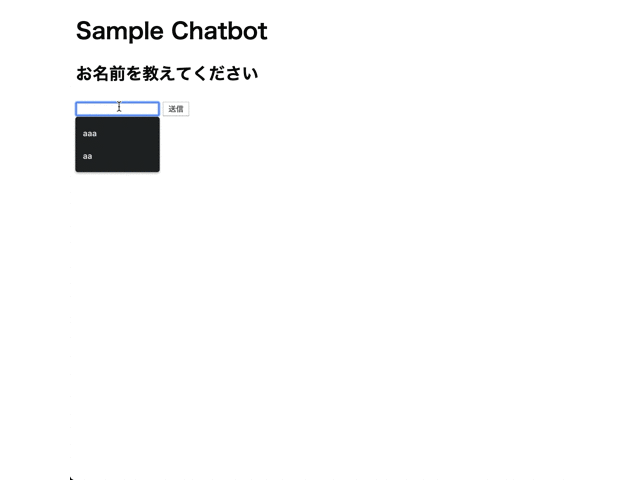

# JavaScript 演習問題

## 1. 以下のGIF画像のような画面を作成せよ。

画面の仕様は以下に示す。

- テキストボックスにカラーコードもしくはカラーネームを入力し、送信ボタンを押下すると、
`色を変更します。`と書かれた要素の背景色が入力した色に変化すること。

## 2. 以下のGIF画像のような画面を作成せよ。

画面の仕様は以下に示す。

- テキストボックスに数字を入力し、送信ボタンを押下すると、入力した数値だけの段数を持ったピラミットが`*`で表示されること。

## 3. 以下のGIF画像のような画面を作成せよ。

画面の仕様は以下に示す。

- 表示する質問は以下の質問である。
    1. お名前を教えてください
    2. 出身地を教えてください
    3. 趣味を教えてください
    4. 好きな食べ物を教えてください

- テキストボックスに質問の回答を入力し送信ボタンを押下すると、その質問と回答がテキストボックスの下に質問順で表示されること。

- 4. の質問に回答後は、テキストボックスと送信ボタンは非活性となること
